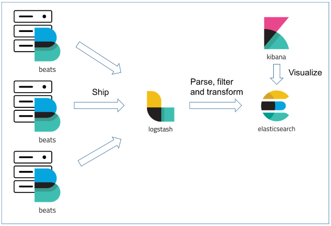
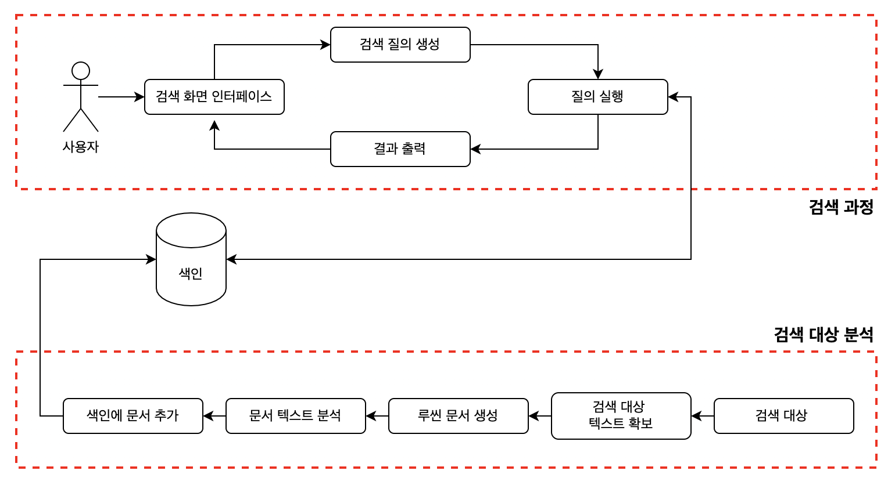
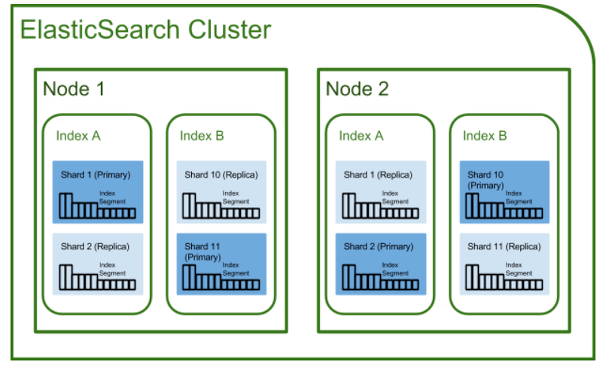

> 사내 데이터포털에 ELK 스택을 도입하면서 학습한 내용을 정리했습니다.  
> 틀린 내용이 있을 수 있습니다.

## ElasticSearch란 (ELK 스택)

Elasticsearch는 Apache Lucene 기반의 Java 오픈소스 분산형 RESTful 검색 엔진입니다.  
방대한 양의 데이터에 대해 실시간으로 저장과 검색 및 분석 등의 작업을 수행할 수 있습니다.  
JSON 문서(Document)로 데이터를 저장하기 때문에 정형 데이터, 비정형 데이터, 지리 데이터 등 다양한 데이터를 처리할 수 있습니다.  
Elasticsearch는 단독 검색을 위해 사용하거나 ELK(Elasticsearch & Logstash & Kibana) 스택을 기반으로 사용합니다.

ELK는 Elasticsearch + Logstash + Kibana를 같이 연동하여 사용한다는 의미입니다.  
ELK에 Filebeat까지 추가하여 Elastic Stack이라고 부르기도 합니다.

- Filebeat
  - 로그를 생성하는 서버에 설치해 로그를 수집합니다.
  - Logstash 서버로 로그를 전송합니다.
- Logstash
  -로그 및 트랜잭션 데이터를 수집, 집계 및 파싱하여 Elasticsearch로 전달합니다.
  -정제 및 전처리를 담당합니다.
- Elasticsearch
  - Logstash로부터 전달받은 데이터를 저장하고 검색 및 집계 등의 기능을 제공합니다.
- Kibana
  - 저장된 로그를 Elasticsearch의 빠른 검색을 통해 가져오며 이를 시각화 및 모니터링하는 기능을 제공합니다.

## Apache Lucene

루씬은 자바로 만들어진 고성능 정보 검색 라이브러리로 ES 내에서 실질적으로 돌아가는 검색 엔진입니다.  
파일 검색이나 웹 문서 수집, 웹 검색 등에 바로 사용할 수는 없고 검색 기능을 가지고 있는 어플리케이션을 개발할 때 사용할 수 있는 라이브러리입니다.  
루씬의 검색 어플리케이션 구조는 검색 대상 분석 과 검색 과정으로 나뉘어 집니다.

## RDBMS와의 비교

| RDBMS | ElasticSearch |
|---|---|
| Database | Index |
| Table | Type |
| Row | Document |
| Column | Field |
| Index | Analyze |
| Primary Key | _id |
| Schema | Mapping |
| Physical partition | Shard |
| Logical partition | Route |
| Relational | Parent/Child, Nested |
| SQL | Query DSL |

Elasticsearch는 데이터를 JSON 문서(Document)로 직렬화된 복잡한 자료 구조로 저장하는 방식을 채택하고 있습니다. 따라서 기존 RDBMS에서 사용하던 용어를 그대로 사용하지 않습니다.  
하지만 RDBMS에 대응되는 적합한 용어들이 존재하여 위와 같이 매칭시킬 수 있습니다.

## 역색인(Reverted Index)

Elasticsearch는 역색인이라고 하는 자료구조를 사용하는데, 이는 전문 검색에 있어서 빠른 성능을 보장합니다.  
책의 전반부에 위치한 일반적인 목차가 Index라면, 책 후반부에 키워드마다 내용을 찾아볼 수 있도록 돕는 목차가 Reverted Index입니다.  
Elasticsearch는 특정 문장을 입력받으면, 파싱을 통해 문장을 단어(Term) 단위로 분리하여 저장합니다. 또한 대문자를 소문자로 치환하거나 유사어 체크 등의 추가 작업을 통해 텍스트를 저장합니다.  
역색인은 각 Document에 등장하는 모든 고유한 단어들을 리스트업하고, 해당 단어들이 등장하는 Document들을 식별합니다.

## 기본 아키텍처 정리

- Cluster
  - 최소 하나 이상의 노드로 이루어진 노드들의 집합을 의미합니다.
  - 서로 다른 클러스터는 데이터의 접근 및 교환을 할 수 없는 독립적인 시스템으로 유지됩니다.
  - 여러 대의 서버가 하나의 클러스터를 구성하거나, 하나의 서버에 여러 개의 클러스터가 존재할 수 있습니다.
- Node
  - Elasticsearch를 구성하는 하나의 단위 프로세스를 의미합니다.
  - Node는 다양한 역할로 분류할 수 있습니다.
    - 메타 데이터 등 전체 클러스터를 제어하는 마스터 노드
      - 인덱스 생성, 삭제
      - 클러스터 노드 추적, 관리
      - 입력된 데이터를 Shard에 할당
    - 데이터의 CRUD 작업을 수행하는 노드
    - 데이터 변환 등 사전 처리 파이프라인 노드
    - 대규모 클러스터에서 로드 밸런싱 역할을 하는 노드
- Shard
  - 데이터를 분산해서 저장하는 방법을 의미합니다.
  - Scale-Out을 위해 RDB의 Database에 해당하는 Index를 여러 Shard로 쪼갭니다.
  - 기본적으로 1개가 존재하며, 검색 성능 향상을 위해 클러스터의 Shard 개수를 조정할 수 있습니다.
- Replica
  - 또 다른 형태의 Shard를 의미합니다.
  - 노드를 손실했을 경우, 데이터의 신뢰성을 위해 Shard를 복제하는 것입니다.
  - Replica는 서로 다른 노드에 위치시키는 것을 권장하고 있습니다.

## 특징

- Scale-out : Shard를 통해 규모가 수평적으로 늘어날 수 있습니다.
- 고가용성 : Replica를 통해 데이터의 안정성을 보장합니다.
- RESTful : CRUD 작업은 RESTful API를 통해 수행되며 HTTP의 GET / POST / PUT / DELETE 메서드에 대응됩니다.